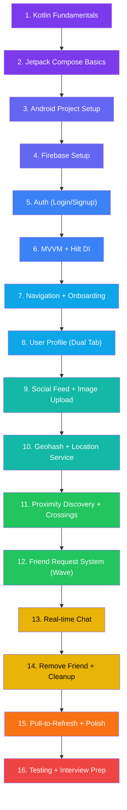

# 🛠️ Build Campus Connect from Scratch — Study Plan & Flowchart

A step-by-step learning path to build this entire app from zero, with the best free resources for each topic.

---

## 📊 Build Order Flowchart

---

## Phase 1: Language & UI Foundation (Week 1–2)

### Step 1: Kotlin Fundamentals
> _Learn the language before touching Android_

**What to learn**: Null safety, data classes, sealed classes, lambdas, scope functions (`let`, `apply`, `run`), coroutines (`launch`, `async`, `suspend`, `withContext`), Flows (cold vs hot, `StateFlow`, `callbackFlow`), `Result<T>` pattern

**📖 Documentation**
- [Kotlin Official Docs](https://kotlinlang.org/docs/home.html) — The definitive reference
- [Kotlin Koans](https://play.kotlinlang.org/koans/overview) — Interactive exercises (do ALL of them)
- [Coroutines Guide](https://kotlinlang.org/docs/coroutines-guide.html) — Official coroutines tutorial

**🎬 Videos**
- [Kotlin Course for Beginners — freeCodeCamp (14hrs)](https://www.youtube.com/watch?v=EExSSotojVI) — Complete zero-to-hero
- [Kotlin Coroutines — Philipp Lackner (playlist)](https://www.youtube.com/playlist?list=PLQkwcJG4YTCQcFEPuYGuv54nYai_lwil_) — Best coroutines playlist on YouTube
- [Roman Elizarov — Coroutines Deep Dive](https://www.youtube.com/watch?v=a3agLJQ6DJUk) — By the creator of Kotlin coroutines

---

### Step 2: Jetpack Compose Basics
> _Modern Android UI — this is what companies hire for_

**What to learn**: `@Composable` functions, `remember`, `mutableStateOf`, `Column`/`Row`/`Box`, `Scaffold`, `LazyColumn` with `key`, `Modifier` ordering, Material 3 components (`Card`, `TopAppBar`, `BottomNavigation`), `LaunchedEffect`, `collectAsState()`

**📖 Documentation**
- [Compose Tutorial — Official](https://developer.android.com/jetpack/compose/tutorial) — Start here
- [Compose Pathway — Google Codelab](https://developer.android.com/courses/pathways/compose) — Hands-on labs
- [State in Compose](https://developer.android.com/jetpack/compose/state) — Critical to understand
- [Side Effects in Compose](https://developer.android.com/jetpack/compose/side-effects) — LaunchedEffect, DisposableEffect

**🎬 Videos**
- [Jetpack Compose Full Course — Philipp Lackner (playlist)](https://www.youtube.com/playlist?list=PLQkwcJG4YTCSpJ2NLhDTHhi6XBNfk9WiC) — Best Compose playlist
- [Compose for Beginners — Android Developers (official)](https://www.youtube.com/watch?v=cDabx3SjuOY) — Google's own introduction
- [LazyColumn Deep Dive — Philipp Lackner](https://www.youtube.com/watch?v=1ANt65eoNhQ) — Lists done right

---

## Phase 2: Project Setup & Auth (Week 2–3)

### Step 3: Android Project Setup
> _Create the project structure that you'll build on_

**What to do**: Create new Android project in Android Studio with Compose template, set up `build.gradle.kts` with dependencies (Compose BOM, Material 3, Navigation, Hilt, Firebase, Coil), configure `compileSdk = 34`, `minSdk = 26`, `jvmTarget = "17"`

**📖 Documentation**
- [Create Your First App — Official](https://developer.android.com/training/basics/firstapp) — Studio setup
- [Gradle for Android — Official](https://developer.android.com/build) — Build config

**🎬 Videos**
- [Android Studio Setup 2024 — Philipp Lackner](https://www.youtube.com/watch?v=mXjZQX3UzOs) — Quick setup walkthrough

---

### Step 4: Firebase Setup
> _Connect your app to Firebase backend_

**What to do**: Create Firebase project, add `google-services.json`, enable Auth (Email/Password), create Firestore database, enable Firebase Storage, set security rules

**📖 Documentation**
- [Add Firebase to Android — Official](https://firebase.google.com/docs/android/setup) — Step-by-step
- [Firestore Getting Started](https://firebase.google.com/docs/firestore/quickstart) — CRUD basics
- [Firebase Storage](https://firebase.google.com/docs/storage/android/start) — File uploads

**🎬 Videos**
- [Firebase + Jetpack Compose — Philipp Lackner](https://www.youtube.com/watch?v=TwHmrZxiPA8) — Full tutorial
- [Firebase Firestore Tutorial — Fireship (12min)](https://www.youtube.com/watch?v=v_hR4K4auoQ) — Fast overview of Firestore concepts

---

### Step 5: Auth (Login/Signup)
> _First real feature — user authentication_

**What to build**: Login screen, Signup screen, `AuthRepository` (wrapping Firebase Auth), `AuthViewModel` with `AuthUiState(isLoggedIn, isAuthChecking, isOnboarded)`, email/password auth

**📖 Documentation**
- [Firebase Auth — Android](https://firebase.google.com/docs/auth/android/start) — Email/password auth
- [Auth State Listener](https://firebase.google.com/docs/auth/android/manage-users) — Observe login state

**🎬 Videos**
- [Firebase Auth + Compose — Philipp Lackner](https://www.youtube.com/watch?v=LHh2_TXBmS8) — Login/Signup with Compose
- [MVVM Firebase Auth — Stevdza-San](https://www.youtube.com/watch?v=n0gG3hOFL7g) — MVVM pattern with Firebase

---

### Step 6: MVVM + Hilt DI
> _The architecture that holds everything together_

**What to build**: `AppModule` (provides Firebase singletons), `@HiltAndroidApp`, `@AndroidEntryPoint`, `@HiltViewModel` ViewModels, Repository pattern with constructor injection

**📖 Documentation**
- [Guide to App Architecture — Official](https://developer.android.com/topic/architecture) — Google's architecture guide
- [Hilt — Official](https://developer.android.com/training/dependency-injection/hilt-android) — DI setup
- [Hilt Codelab](https://developer.android.com/codelabs/android-hilt) — Hands-on

**🎬 Videos**
- [Hilt in 15 Minutes — Philipp Lackner](https://www.youtube.com/watch?v=bbMsuI2p1DQ) — Quick Hilt setup
- [MVVM Explained — Philipp Lackner](https://www.youtube.com/watch?v=VfdGzKOgoaM) — Clear MVVM explanation
- [Clean Architecture — Philipp Lackner](https://www.youtube.com/watch?v=EF33KmyprEQ) — Full MVVM + Clean Arch

---

## Phase 3: Core Features (Week 3–4)

### Step 7: Navigation + Onboarding
> _Multi-screen app with auth-driven navigation_

**What to build**: `NavRoutes` sealed class, `AppNavHost` with Login/Onboarding/Home routes, Bottom Navigation (Feed/Discover/Chat/Profile tabs), reactive `LaunchedEffect` that navigates based on auth state

**📖 Documentation**
- [Navigation in Compose — Official](https://developer.android.com/jetpack/compose/navigation) — Routes, arguments, nested graphs
- [Bottom Navigation — Material 3](https://developer.android.com/reference/kotlin/androidx/compose/material3/package-summary#NavigationBar) — Tab bar

**🎬 Videos**
- [Compose Navigation — Philipp Lackner](https://www.youtube.com/watch?v=4gUeyNkGE3g) — Full navigation setup
- [Bottom Nav + Compose — Stevdza-San](https://www.youtube.com/watch?v=c8XP_Ee7iqY) — Tab navigation

---

### Step 8: User Profile (Dual Tab)
> _Social + Professional profile with photo upload_

**What to build**: `ProfileScreen` with Social/Professional tabs (`TabRow`), `ProfileViewModel`, `EditProfileScreen`, profile photo upload to Firebase Storage, `LinkRow` for clickable LinkedIn/GitHub URLs using `LocalUriHandler`

**📖 Documentation**
- [Tabs — Material 3](https://developer.android.com/reference/kotlin/androidx/compose/material3/package-summary#TabRow) — TabRow component
- [Photo Picker](https://developer.android.com/training/data-storage/shared/photopicker) — Android photo picker
- [Firebase Storage Upload](https://firebase.google.com/docs/storage/android/upload-files) — Image upload

**🎬 Videos**
- [Image Picker + Coil — Philipp Lackner](https://www.youtube.com/watch?v=VhUERskSvQk) — Pick and display images
- [Firebase Storage Upload — Philipp Lackner](https://www.youtube.com/watch?v=mAJei_l0ris) — Upload files to Storage

---

### Step 9: Social Feed + Image Upload
> _Posts with photos, likes, comments_

**What to build**: `FeedRepository` (CRUD + `callbackFlow` for real-time), `FeedViewModel`, `FeedScreen` with `LazyColumn`, `CreatePostScreen` with photo picker, `PostCard` with like/comment/share actions, friends-only feed filtering, `PostDetailScreen` with comments sub-collection

**Key concepts**: `callbackFlow` to bridge Firestore listeners → Kotlin Flow, Firestore transactions for concurrent likes, content URI lifecycle (wait for upload before nav), `Result<T>` error handling

**📖 Documentation**
- [Firestore Real-time Listeners](https://firebase.google.com/docs/firestore/query-data/listen) — Snapshot listeners
- [callbackFlow — Kotlin](https://kotlinlang.org/api/kotlinx.coroutines/kotlinx-coroutines-core/kotlinx.coroutines.flow/callback-flow.html) — Bridge callbacks to Flow
- [Firestore Transactions](https://firebase.google.com/docs/firestore/manage-data/transactions) — Atomic operations

**🎬 Videos**
- [Social Media App Feed — Philipp Lackner](https://www.youtube.com/watch?v=8bGIhMKwOSU) — Building a feed
- [Firestore Transactions — Firebase (official)](https://www.youtube.com/watch?v=dOVSr0OsAoU) — How transactions work
- [callbackFlow Explained — Florian Walther](https://www.youtube.com/watch?v=ZX8VsqNO_Ss) — Bridging Firebase + Flows

---

## Phase 4: Proximity & Social Features (Week 4–5)

### Step 10: Geohashing + Location Service
> _The unique selling point of the app_

**What to build**: `LocationService` (foreground service, `FusedLocationProviderClient`, 30-second updates), geohash encoding algorithm, write location + geohash to Firestore, persistent notification

**Key concepts**: Foreground service lifecycle, `PRIORITY_BALANCED_POWER_ACCURACY`, runtime permissions (`ACCESS_FINE_LOCATION`, `POST_NOTIFICATIONS`), geohash precision levels

**📖 Documentation**
- [Foreground Services — Official](https://developer.android.com/guide/components/foreground-services) — Service lifecycle
- [FusedLocationProvider](https://developers.google.com/android/reference/com/google/android/gms/location/FusedLocationProviderClient) — GPS API
- [Geohashing Explained — Wikipedia](https://en.wikipedia.org/wiki/Geohash) — Algorithm deep-dive
- [Runtime Permissions](https://developer.android.com/training/permissions/requesting) — Permission model

**🎬 Videos**
- [Foreground Service — Philipp Lackner](https://www.youtube.com/watch?v=YZL-_XJSClc) — Android service tutorial
- [Location Tracking — Philipp Lackner](https://www.youtube.com/watch?v=RGKryUxiPl4) — FusedLocationProvider
- [Geohashing Visualized — Computerphile](https://www.youtube.com/watch?v=UaMzra18TD8) — How geohashing works
- [How Uber/Happn Use Geohashing — Gaurav Sen](https://www.youtube.com/watch?v=Xpf5gMFXOoI) — System design perspective

---

### Step 11: Proximity Discovery + Crossings
> _Find nearby users and record crossings_

**What to build**: `DiscoverRepository` (query nearby users by geohash prefix, record crossings with rate-limiting), `DiscoverViewModel`, `DiscoverScreen` with crossing cards, stale-user filtering (30-min cutoff), location toggle

**📖 Documentation**
- [Firestore Queries](https://firebase.google.com/docs/firestore/query-data/queries) — Range queries for geohash prefix
- [Firestore Compound Queries](https://firebase.google.com/docs/firestore/query-data/queries#compound_and_queries) — Multiple where clauses

**🎬 Videos**
- [Firestore Queries — Firebase (official playlist)](https://www.youtube.com/playlist?list=PLl-K7zZEsYLluG5MCVEzXAQ7ACZBCuZgZ) — Query patterns

---

### Step 12: Friend Request System (Wave)
> _The smart Wave → Pending → Friends button_

**What to build**: `sendWave()` with deterministic document IDs (`{fromUid}_{toUid}`), `acceptRequest()` with Firestore transaction + idempotent guard, `declineRequest()`, context-aware button states driven by 3 real-time data sources (crossings, sent requests, friend list), auto-create conversation on acceptance

**📖 Documentation**
- [Firestore Transactions](https://firebase.google.com/docs/firestore/manage-data/transactions) — Atomic reads + writes
- [Firestore Security Rules](https://firebase.google.com/docs/firestore/security/get-started) — Protect data

**🎬 Videos**
- [Firestore Transactions Deep Dive — Fireship](https://www.youtube.com/watch?v=6Gao20_PJLE) — When and why to use transactions

---

## Phase 5: Chat & Polish (Week 5–6)

### Step 13: Real-time Chat
> _Instant messaging between friends_

**What to build**: `ChatRepository` (messages sub-collection with snapshot listener), `ChatViewModel`, `ConversationsScreen` (list of conversations), `ChatDetailScreen` (messages with auto-scroll), `sendMessage()`, `getOrCreateConversation()`

**📖 Documentation**
- [Firestore Sub-collections](https://firebase.google.com/docs/firestore/data-model#subcollections) — Nested data
- [LazyColumn scroll — Official](https://developer.android.com/jetpack/compose/lists#react-to-scroll-position) — Auto-scroll on new messages

**🎬 Videos**
- [Chat App with Firebase — Philipp Lackner](https://www.youtube.com/watch?v=8Pv96bvBJL4) — Full chat implementation
- [Real-time Messaging — Fireship](https://www.youtube.com/watch?v=k6nwFTMYZ3g) — Firestore messaging patterns

---

### Step 14: Remove Friend + Atomic Cleanup
> _Four-step atomic operation_

**What to build**: `removeFriend()` in `DiscoverRepository` — remove from both users' friends arrays (transaction), delete conversation, delete friend request docs. Confirmation dialog in UI. Multi-repo ViewModel (`ChatViewModel` depends on both `ChatRepository` + `DiscoverRepository`).

---

### Step 15: Pull-to-Refresh + Polish
> _UX improvements and reusable components_

**What to build**: `PullRefreshLayout` composable (using Material 2's `pullRefresh` modifier), `isRefreshing` + `refresh()` in ViewModels, `LoadingSpinner` (safe CircularProgressIndicator wrapper), `LinkRow` (clickable URLs with auto `https://`), animations (`animateContentSize`, gradient backgrounds)

**📖 Documentation**
- [Material 2 Pull Refresh](https://developer.android.com/reference/kotlin/androidx/compose/material/pullrefresh/package-summary) — pullRefresh API
- [Compose Animation](https://developer.android.com/jetpack/compose/animation) — Animation APIs

**🎬 Videos**
- [Pull to Refresh in Compose — Philipp Lackner](https://www.youtube.com/watch?v=Yl0hNRGK0kc) — Pull-to-refresh setup
- [Compose Animations — Android Developers](https://www.youtube.com/watch?v=Z_T1bVjhMLk) — Animation patterns

---

### Step 16: Testing + Interview Prep
> _Verify and prepare to present your work_

**What to do**: Run `./gradlew assembleDebug`, test all features on device/emulator, read all `interview-prep/` docs, practice your 30-second and 2-minute pitches

**📖 Documentation**
- [Compose Testing — Official](https://developer.android.com/jetpack/compose/testing) — UI testing
- [Testing Coroutines](https://developer.android.com/kotlin/coroutines/test) — Test async code

**🎬 Videos**
- [Android Testing — Philipp Lackner (playlist)](https://www.youtube.com/playlist?list=PLQkwcJG4YTCSVDhww92llY3CAnc_vUhsm) — Full testing series

---

## 🏆 Essential Channels & Resources (Bookmark These)

| Resource | Why It's The Best |
|----------|-------------------|
| [Philipp Lackner (YouTube)](https://www.youtube.com/@PhilippLackner) | #1 Android + Compose channel. Clear, project-based, always up-to-date |
| [Android Developers (YouTube)](https://www.youtube.com/@AndroidDevelopers) | Official Google channel. Architecture talks, What's New in Android |
| [Fireship (YouTube)](https://www.youtube.com/@Fireship) | 100-second explainers on any tech concept. Great for quick overviews |
| [Stevdza-San (YouTube)](https://www.youtube.com/@StevdzaSan) | Compose + Firebase tutorials, very beginner-friendly |
| [Florian Walther (YouTube)](https://www.youtube.com/@FlorianWalther) | Advanced Kotlin/Android patterns, great Flow/coroutines content |
| [Kotlin Official Docs](https://kotlinlang.org/docs/home.html) | The source of truth for Kotlin language |
| [Android Developer Docs](https://developer.android.com/) | Official Android guides, codelabs, reference |
| [Firebase Docs](https://firebase.google.com/docs) | Official Firebase guides |
| [NeetCode (YouTube)](https://www.youtube.com/@NeetCode) | Best DSA explanations for interview prep |
| [Gaurav Sen (YouTube)](https://www.youtube.com/@gaborsen) | System design fundamentals |

---

## ⏱️ Estimated Timeline

| Phase | Duration | Topics |
|-------|----------|--------|
| Phase 1 | Week 1–2 | Kotlin + Compose |
| Phase 2 | Week 2–3 | Project setup, Firebase, Auth, MVVM, Hilt |
| Phase 3 | Week 3–4 | Navigation, Profile, Feed |
| Phase 4 | Week 4–5 | Geohashing, Discovery, Friend Requests |
| Phase 5 | Week 5–6 | Chat, Polish, Testing |

> **Total: ~6 weeks** at 3–4 hours/day. Faster if you already know Kotlin or have Android experience.

---

## 📋 Interview Cheat Sheet — 2-Month Mastery Plan

> _You already have the finished app. Your goal isn't to rebuild it — it's to **understand and articulate** what's already built._

### 🗓️ Month 1: Understand the "Why" (Concepts)

| Week | Focus | Daily Time |
|------|-------|-----------|
| Week 1 | **Kotlin basics** — null safety, coroutines, Flows, StateFlow | 2 hrs |
| Week 2 | **Jetpack Compose** — how `@Composable` works, recomposition, state, `LaunchedEffect` | 2 hrs |
| Week 3 | **Architecture** — MVVM, Repository pattern, Hilt DI (read YOUR code while learning) | 2 hrs |
| Week 4 | **Firebase** — Firestore data model, transactions, `callbackFlow`, auth | 2 hrs |

### 🗓️ Month 2: Master Your Project + Practice

| Week | Focus | Daily Time |
|------|-------|-----------|
| Week 5 | **Walk through EVERY file** — understand each ViewModel, Screen, Repository | 2 hrs |
| Week 6 | **Deep-dive** — geohashing, friend request system, image upload bug, pull-to-refresh | 2 hrs |
| Week 7 | **Practice Q&A** from `INTERVIEW_QA.md` + challenge stories from `CHALLENGES_FACED.md` **out loud** | 2 hrs |
| Week 8 | **Mock interviews** + system design (scaling to 100K users) + LeetCode | 2 hrs |

> **Total: ~120 hours** of focused study. More than enough to own this project in any interview.

---

### 🎯 What Interviewers Actually Care About

They're **not** going to ask you to recite code. They want to know:

| What They Ask | What They're Really Testing |
|---------------|----------------------------|
| "Why did you make this decision?" | Can you think about trade-offs? |
| "What went wrong and how did you fix it?" | Can you debug and reason about systems? |
| "Explain your architecture" | Do you understand separation of concerns? |
| "How would you scale this?" | Can you think beyond your current scope? |
| "Walk me through a feature" | Can you communicate technical concepts clearly? |

---

### ⚡ The 80/20 Rule — Master These 5 Things

Focus on these and you'll answer **80% of interview questions**:

1. **🎤 30-Second Pitch** — Practice until it's effortless
   > "I built Campus Connect, a campus social networking app with Happn-like proximity discovery using geohashing, a LinkedIn-style feed with photo uploads, real-time chat, and pull-to-refresh..."
   > _(See `PROJECT_OVERVIEW.md`)_

2. **🐛 3 Challenge Stories** — These are GOLD for interviews
   - Image upload bug (content URI lifecycle + silent error swallowing)
   - Duplicate friend requests (deterministic IDs + transactions)
   - Logout not navigating (two sources of truth for auth state)
   > _(See `CHALLENGES_FACED.md`)_

3. **🗺️ Geohashing Explanation** — Your unique differentiator
   - Draw it on a whiteboard: lat/lng → Base32 string → prefix matching
   - Why O(1) instead of O(n) Haversine distance
   - Boundary effects and neighboring tiles
   > _(See `TECHNICAL_DEEP_DIVE.md` Section 1)_

4. **🏗️ MVVM + StateFlow Data Flow** — Architecture understanding
   - Screen → `collectAsState()` → ViewModel → Repository → Firebase
   - `callbackFlow` bridging Firestore listeners to Kotlin Flows
   - Hilt wiring: `@HiltViewModel` + `@Inject constructor`
   > _(See `ARCHITECTURE.md`)_

5. **🔒 Firestore Transactions** — Concurrency handling
   - WHY: concurrent likes, duplicate friend requests, inflated counts
   - HOW: `runTransaction` reads then writes atomically
   - Deterministic document IDs as natural idempotency
   > _(See `TECHNICAL_DEEP_DIVE.md` Section 4)_

---

### 💡 Power Phrases to Use in Interviews

Use these naturally — they signal technical maturity:

- _"I chose X over Y because..."_ (shows trade-off thinking)
- _"The root cause was actually two bugs..."_ (shows debugging depth)
- _"I used deterministic IDs as a form of natural idempotency"_ (shows system design)
- _"I separated `isRefreshing` from `isLoading` because..."_ (shows UX thinking)
- _"For production, I would add..."_ (shows self-awareness and growth)
- _"The `callbackFlow` bridges Firebase's callback API to Kotlin's coroutines world"_ (shows reactive thinking)
- _"Material 2 and Material 3 can coexist — I only pulled in the specific API I needed"_ (shows pragmatic engineering)

---

_You built something real. Now go show them._ 🔥
